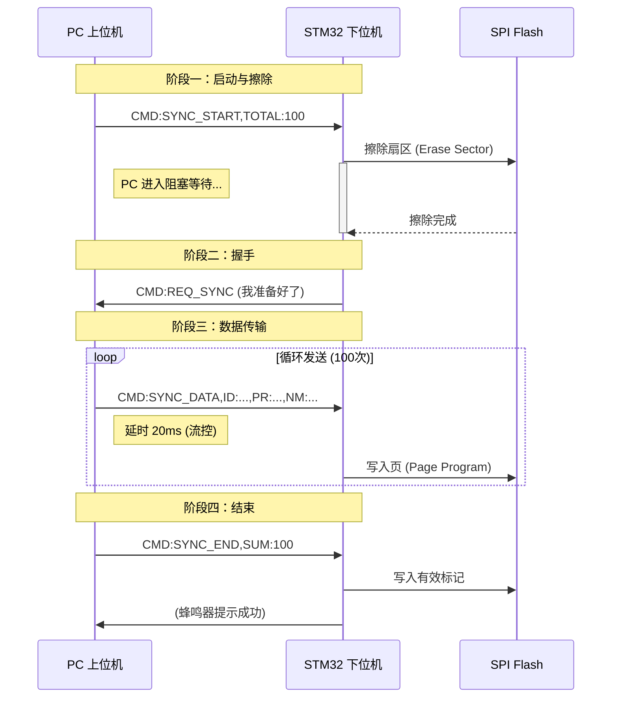

# 无人超市系统串口通讯协议 (V3.0)

## 1\. 协议概述

本协议用于上位机（PC）与 STM32 主控板之间的通信，主要用于商品销售数据上报、报警监控以及**SPI Flash 本地商品数据库的同步**。

  * **通信接口**：USART (TTL/RS232)
  * [cite_start]**编码格式**：ASCII 文本 [cite: 11]
  * [cite_start]**结束标志**：换行符 `\n` [cite: 11]
  * **字符集**：推荐使用 UTF-8（处理中文商品名）

## 2\. 帧结构定义

采用键值对（Key-Value）结构，具备良好的可读性和扩展性。

**通用格式**：

```text
CMD:指令类型,键1:值1,键2:值2...<换行符>
```

  * [cite_start]**CMD**：指令类型标识 [cite: 14]
  * [cite_start]**键值对**：参数间用逗号 `,` 分隔，键与值用冒号 `:` 连接 [cite: 14]

-----

## 3\. 核心机制：数据同步流程 (Flash Sync)

[cite_start]为了解决大量数据写入 SPI Flash 速度较慢的问题，本版本引入了\*\*“请求-擦除-握手-传输”\*\*的四阶段同步机制 [cite: 32]。

### 阶段一：启动与擦除 (Initiate & Erase)

1.  **PC 发送**：`SYNC_START` 指令，告知即将发送的数据总量。
2.  [cite_start]**STM32 动作**：挂起非必要任务（如扫码中断），调用底层驱动擦除 Flash 指定扇区 [cite: 19, 36]。
3.  [cite_start]**PC 状态**：发送指令后**立即进入阻塞等待状态**，暂不发送具体数据 [cite: 37]。

### 阶段二：握手确认 (Handshake)

1.  [cite_start]**STM32 动作**：Flash 擦除完成（耗时约 1-2秒），主动发送 `REQ_SYNC` 信号 [cite: 30, 40]。
2.  [cite_start]**PC 状态**：收到 `REQ_SYNC`，确认下位机缓冲区已就绪，进入发送模式 [cite: 41]。

### 阶段三：流控传输 (Transmission & Flow Control)

1.  **PC 发送**：循环发送 `SYNC_DATA` 指令。
2.  [cite_start]**流控保护**：PC 在每条数据后加入**微小延时**（建议 20ms），防止串口缓冲区溢出，给予 STM32 写入 Flash 页的时间 [cite: 44, 45]。

### 阶段四：结束与校验 (Finalize)

1.  **PC 发送**：发送完毕后发出 `SYNC_END`。
2.  [cite_start]**STM32 动作**：校验数量完整性，在 Flash 头部写入“有效标记”，恢复正常业务逻辑 [cite: 25, 49]。

-----

## 4\. 指令集详细定义

### 4.1 下行指令 (PC -\> STM32)

| 指令类型 (CMD) | 完整格式示例 | 功能说明 | 备注 |
| :--- | :--- | :--- | :--- |
| **SYNC\_START** | `CMD:SYNC_START,TOTAL:100` | [cite_start]**启动同步**<br>通知 STM32 准备同步，TOTAL 为商品总数 [cite: 18]。 | 触发 Flash 擦除，PC 需等待握手。 |
| **SYNC\_DATA** | `CMD:SYNC_DATA,ID:6901,PR:3.5,NM:Cola` | [cite_start]**传输数据**<br>单条商品信息包 [cite: 21, 22]。<br>`ID`: 条码, `PR`: 价格, `NM`: 名称 | 发送频率需配合延时流控。 |
| **SYNC\_END** | `CMD:SYNC_END,SUM:100` | [cite_start]**结束同步**<br>告知发送结束，SUM 为发送总条数 [cite: 24]。 | 用于完整性校验。 |
| **SCAN** | `CMD:SCAN,ID:6912345678` | **模拟扫码**<br>PC 模拟扫码枪发送条码给 STM32。 | 调试用。 |

### 4.2 上行指令 (STM32 -\> PC)

| 指令类型 (CMD) | 完整格式示例 | 功能说明 | 备注 |
| :--- | :--- | :--- | :--- |
| **REQ\_SYNC** | `CMD:REQ_SYNC` | [cite_start]**请求发送/握手信号**<br>表示 Flash 擦除完成，请求上位机开始发送数据流 [cite: 30]。 | **关键握手信号**。 |
| **REPORT** | `CMD:REPORT,ID:6901,QT:1` | **销售上报**<br>STM32 识别条码后上报销售记录。 | `ID`: 条码, `QT`: 数量。 |
| **ALARM** | `CMD:ALARM,LEVEL:1,MSG:Fire_Err` | **系统报警**<br>上报环境异常或硬件错误。 | `LEVEL`: 等级, `MSG`: 消息。 |

-----

## 5\. 通信流程图解

